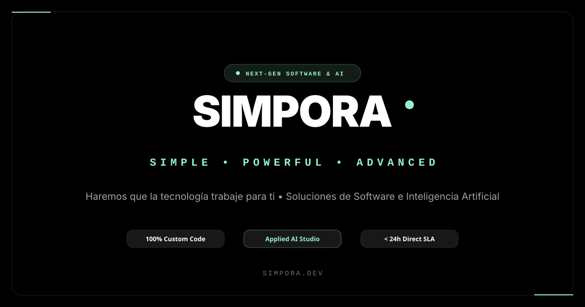

<div align="center">
  

  <br /><br />

  <h1>SIMPORA</h1>
  <p><strong>Simple. Powerful. Advanced.</strong></p>
  <p>Estudio de ingeniería de software a medida y soluciones de inteligencia artificial aplicada.</p>

  <p>
    <a href="https://simpora.dev"></a>
    
    
    
    
    
  </p>
</div>

---

## ⚡ Acerca de SIMPORA

**SIMPORA** ([simpora.dev](https://simpora.dev)) es un estudio boutique de ingeniería de sistemas e inteligencia artificial aplicada fundado y liderado técnicamente por **Jonathan A. Dubón**.

Construimos plataformas digitales de misión crítica, arquitecturas en la nube escalables y agentes de inteligencia artificial generativa con un principio irrenunciable: **100% código limpio, robusto y sin atajos técnicos**.

---

## 🚀 Características Principales

- **🛰️ Epic Sci-Fi Preloader:** Animación cinemática de arranque a 60 FPS con secuencia de ignición, telemetría HUD y estrellas fugaces cósmicas.
- **✨ Constelación Neuronal Holográfica Global:** Lienzo Canvas interactivo con nodos cuánticos y conexiones sinápticas que fluyen de forma continua y autónoma a través de toda la aplicación.
- **🧠 AI Solution Finder:** Diagnóstico arquitectónico en vivo impulsado por Google Gemini con estimación de timeline, proyección de ROI, stack recomendado y plan de acción escalonado.
- **🤖 Asistente de IA con Balanceo de Carga:** Chatbot consultor con balanceador dinámico round-robin multimodelo (`gemini-2.5-flash`, `gemini-2.5-pro`, `gemini-3.0-flash`, `gemini-flash-lite`, etc.) con failover instantáneo.
- **💎 Holographic 3D Bento Cards:** Tarjetas con inclinación giroscópica 3D (tilt reactivo), refracción holográfica y destello especular que sigue al cursor.
- **📱 100% Responsive Design:** Adaptado minuciosamente para smartphones pequeños (desde 360px), tablets y monitores ultrawide 4K.
- **🌐 Internacionalización Completa:** Soporte bilingüe instantáneo (Español / Inglés) con persistencia local y sincronización de metadatos SEO.
- **🔍 Suite SEO de Vanguardia:** Marcado estructurado Schema.org (JSON-LD) para `Organization`, `ProfessionalService`, `WebSite` y `FAQPage`, `sitemap.xml`, `robots.txt` y tarjetas sociales Open Graph / Twitter Card.

---

## 🛠️ Stack Tecnológico

| Capa | Tecnologías |
| :--- | :--- |
| **Frontend** | React 19, TypeScript 5.7, Vite 6, Tailwind CSS 4 |
| **Animaciones & Física** | Motion (Framer Motion), Canvas 2D API Hardware-Accelerated |
| **Modelos de IA** | Google AI Studio (Gemini 2.5 / 3.0 Multimodel API con Failover) |
| **Backend / API** | Node.js, Express, ESBuild |
| **Iconografía & Assets** | Lucide React, SVG Nativo Optimizado |

---

## 📦 Instalación y Ejecución Local

### Prerrequisitos
- [Node.js](https://nodejs.org/) (versión 18 o superior)
- `npm` o `pnpm`

### 1. Clonar el repositorio
```bash
git clone https://github.com/simporatech/simpora-website.git
cd simpora-website
```

### 2. Instalar dependencias
```bash
npm install
```

### 3. Configurar variables de entorno
Crea un archivo `.env` en la raíz (puedes tomar como base `.env.example`):
```env
GEMINI_API_KEY="tu_api_key_de_google_ai_studio"
VITE_GEMINI_API_KEY="tu_api_key_de_google_ai_studio"
PORT=3000
```

### 4. Iniciar el servidor de desarrollo
```bash
npm run dev
```
Abre en tu navegador: [http://localhost:3000](http://localhost:3000)

### 5. Compilar para producción
```bash
npm run build
```

---

## 📂 Estructura del Proyecto

```
SIMPORA/
├── public/
│   ├── favicon.svg              # Isotipo oficial SIMPORA
│   ├── robots.txt               # Directivas de rastreo para buscadores
│   ├── sitemap.xml              # Mapa del sitio con soporte multilingüe
│   └── simpora-og.svg           # Banner de alta resolución para previsualizaciones
├── src/
│   ├── assets/                  # Vectores e isotipos del sistema
│   ├── components/              # Componentes visuales e interactivos
│   │   ├── EpicPreloader.tsx    # Pantalla de carga con cohete y estrellas fugaces
│   │   ├── NeuralConstellation  # Canvas de partículas y sinapsis en toda la app
│   │   ├── ServicesBento.tsx    # Tarjetas bento holográficas 3D
│   │   ├── SolutionFinder.tsx   # Diagnóstico de proyectos con Gemini AI
│   │   ├── GeminiChatModal.tsx  # Chat consultor multimodelo
│   │   ├── CustomCursor.tsx     # Cursor de precisión con ondas cuánticas
│   │   ├── NpuChip.tsx          # Microchip 3D interactivo en Hero
│   │   └── ...                  # Navbar, Hero, About, Footer, Contacto, etc.
│   ├── context/                 # Contexto global de idioma (ES/EN)
│   ├── data/                    # Contenidos y esquemas de traducción
│   ├── App.tsx                  # Layout principal y orquestación
│   └── main.tsx                 # Punto de entrada de React
├── server.ts                    # Servidor Express con balanceador dinámico Gemini
└── index.html                   # HTML canónico con metadatos SEO y JSON-LD
```

---

## 👨‍💻 Liderazgo y Contacto

- **Fundador & Ingeniero Líder:** Jonathan A. Dubón
- **Sitio Web Oficial:** [https://simpora.dev](https://simpora.dev)
- **Correo Corporativo:** [info@simpora.dev](mailto:info@simpora.dev)
- **WhatsApp Directo:** [+502 3023-0303](https://wa.me/50230230303)

---

<div align="center">
  <p>© 2026 SIMPORA. Todos los derechos reservados.</p>
  <p><em>Simple • Powerful • Advanced</em></p>
</div>
